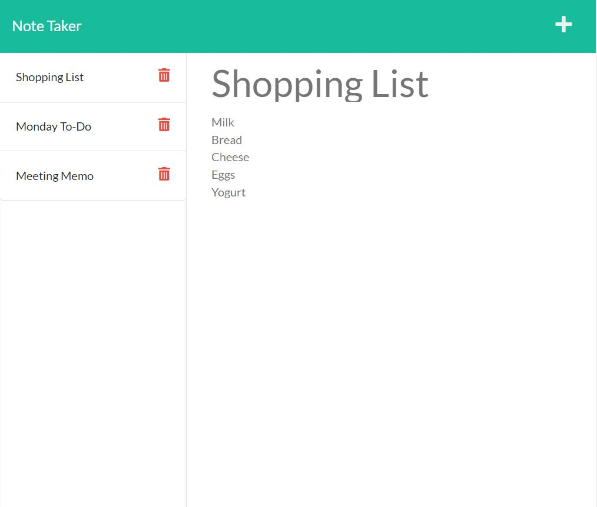

# Note Server

## Description

  Note server is a persistent online app that allows users to wriet and save notes. The backend it built using Node +  Express.js and the server is deployed via Heroku at [https://abrowncownow-note-server.herokuapp.com/](https://abrowncownow-note-server.herokuapp.com/). Find the repo on github at [https://github.com/abrowncownow/note-server](https://github.com/abrowncownow/note-server).

## Table of Contents

  Use the links below to navigate to different sections of the README.

-   [Installation](#installation)
-   [Usage](#usage)
-   [License](#license)
-   [Contributing](#contributing)
-   [Tests](#tests)
-   [Questions](#questions)

## Installation

  Navigate to [https://abrowncownow-note-server.herokuapp.com/](https://abrowncownow-note-server.herokuapp.com/). Click on the "Get Started" button.

## Usage

  Enter a title for your note in the "Note Title" section and recored your note in the "Note Text" section. When the note is completed, click the save icon in the top-right corner of the window. The saved note will be added to the note list on the left. You can select a note from the note list to view it. If you'd like to add a new note, click on the "+" icon in the top right. Click on the red trash can next to the note titles you wish to delete from the note list.

## License
  

  Copyright 2022 Alex Brown

  
Permission is hereby granted, free of charge, to any person obtaining a copy of this software and associated documentation files (the "Software"), to deal in the Software without restriction, including without limitation the rights to use, copy, modify, merge, publish, distribute, sublicense, and/or sell copies of the Software, and to permit persons to whom the Software is furnished to do so, subject to the following conditions:

The above copyright notice and this permission notice shall be included in all copies or substantial portions of the Software.

THE SOFTWARE IS PROVIDED "AS IS", WITHOUT WARRANTY OF ANY KIND, EXPRESS OR IMPLIED, INCLUDING BUT NOT LIMITED TO THE WARRANTIES OF MERCHANTABILITY, FITNESS FOR A PARTICULAR PURPOSE AND NONINFRINGEMENT. IN NO EVENT SHALL THE AUTHORS OR COPYRIGHT HOLDERS BE LIABLE FOR ANY CLAIM, DAMAGES OR OTHER LIABILITY, WHETHER IN AN ACTION OF CONTRACT, TORT OR OTHERWISE, ARISING FROM, OUT OF OR IN CONNECTION WITH THE SOFTWARE OR THE USE OR OTHER DEALINGS IN THE SOFTWARE.

[MIT](https://opensource.org/licenses/MIT)

## Contributing

  Front-end built by TrilogyEd. Back-end by Alex Brown.

  This readme was generated by Readme Pro Gen 9000. See more of my creations at [@abrowncownow](https://https://github.com/abrowncownow)

## Tests

  Navigate to [https://abrowncownow-note-server.herokuapp.com/](https://abrowncownow-note-server.herokuapp.com/)

## Questions

  Check out my other github projects at: [@abrowncownow](https://github.com/abrowncownow).

  Or email me at [abrowncownow@gmail.com](abrowncownow@gmail.com) with any additional questions.
